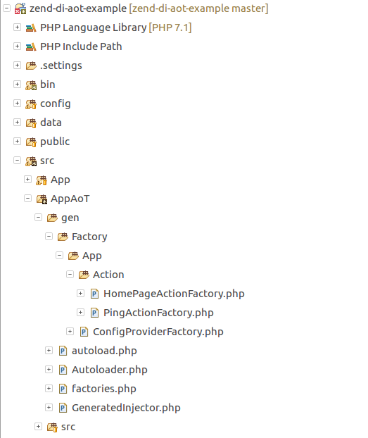

# Using AoT With Zend Expresive And ServiceManager

This guide will show you how you can use zend-di's AoT compiler
to make your ZendFramework application production ready.

You will learn how to:

* Add a script to run the compilation
* Use the generated injector with ServiceManager
* Use the generated factories with ServiceManager

## 1. Create project and add zend-di

For this guide will use an [expressive application](https://docs.zendframework.com/zend-expressive/)
with zend-servicemanager as an example.

If you already set up a project with zend-di, you can skip this step.

```bash
composer create-project zendframework/zend-expressive-skeleton zend-di-aot-example
```

Pick the components you want to use. As statet above, we will be using Zend ServiceManager
and a Modular layout for this example.

Now add zend-di and zend-code with composer:

```bash
composer require zendframework/zend-di=^3.0
composer require --dev zendframework/zend-code
```

The component installer should ask you where to inject the config provider. Pick option 1
which usually is `config/config.php`. If not or you cannot use the component installer, you have to add it
manually by adding `\Zend\Di\ConfigProvider::class` to your config (in `config/config.php` for example):

```php
<?php

use Zend\ConfigAggregator\ArrayProvider;
use Zend\ConfigAggregator\ConfigAggregator;
use Zend\ConfigAggregator\PhpFileProvider;

// ...

$aggregator = new ConfigAggregator([
    // Add Zend\Di
    \Zend\Di\ConfigProvider::class,

    // ...
], $cacheConfig['config_cache_path']);

// ...
```

## 2. Make your project ready for AoT

To follow the modular principle of our expressive app, we will
put the AoT related configurations and generated code in a separate module called `AppAoT`:

```bash
mkdir src/AppAoT/src
```

Create a config provider in `src/AppAoT/src/ConfigProvider.php`:

```php
<?php

namespace AppAoT;

class ConfigProvider
{
    public function __invoke()
    {
        return [];
    }
}
```

Add it at the beginning of your `config/config.php`:

```php
$aggregator = new ConfigAggregator([
    \AppAoT\ConfigProvider::class
    // Add Zend\Di
    \Zend\Di\ConfigProvider::class,

    // ...
]);
```

Now you have to add the psr-4 autoload section for `AppAoT\\`
in your `composer.json`:

```json
{
    "autoload": {
        "psr-4": {
            "App\\": "src/App/src/",
            "AppAoT\\": "src/AppAoT/src/",
            "AppAoT\\Generated\\": "src/AppAoT/gen/"
        }
    },
    ...
}
```

> Note that we defined `AppAoT\\Generated\\` which will point to the code
> we generate from di in the next steps

Finally, update your autoloader:

```bash
composer dump-autoload
```

## 3. Add some auto-wiring

For the sake of simplicity, we just remove `App\HomePageFactory` from the dependencies
config in `App\ConfigProvider::getDependencies()`:

```php
    public function getDependencies()
    {
        return [
            'invokables' => [
                // Action\PingAction::class => Action\PingAction::class,
            ],
            'factories'  => [
                // Action\HomePageAction::class => Action\HomePageFactory::class,
            ],
        ];
    }
```

... and from the filesystem.

```bash
rm src/App/src/HomePageFactory.php
```

The default actions (`HomePageAction` and `PingAction`) now use auto wiring

## 4. Add a code generator command script

In this guide, we will add a simple script in the `bin/` directory, which
we will add to composer scripts, that will perform the task.
In the real world, you might use a console implementation like Symfony Console for example.

Add the generator script `bin/di-generate-aot.php`:

```php
<?php

namespace AppAoT;

use Psr\Container\ContainerInterface;
use Zend\Code\Scanner\DirectoryScanner;
use Zend\Di\CodeGenerator\InjectorGenerator;
use Zend\Di\Config;
use Zend\Di\ConfigInterface;
use Zend\Di\Definition\RuntimeDefinition;
use Zend\Di\Resolver\DependencyResolver;


require __DIR__ . '/../vendor/autoload.php';

function getClassNames(): iterable
{
    // Define the source directories to scan for classes to generate
    // AoT factories for
    $directories = [
        __DIR__ . '/../src/App/src',
    ];

    $scanner = new DirectoryScanner($directories);

    /** @var \Zend\Code\Scanner\ClassScanner $class */
    foreach ($scanner->getClasses() as $class) {
        yield $class->getName();
    }
}

// Generator dependencies - you might put this in a service factory
// in a real-life scenario

/** @var ContainerInterface $container */
$container = require __DIR__ . '/../config/container.php';
$config = $container->get(ConfigInterface::class);
$resolver = new DependencyResolver(new RuntimeDefinition(), $config);

// This is important, we want to use configured aliases of the service manager
$resolver->setContainer($container);

$generator = new InjectorGenerator($config, $resolver, __NAMESPACE__ . '\\Generated');
$generator->setOutputDirectory(__DIR__ . '/../src/AppAoT/gen');
$generator->generate(getClassNames());
```

The composer entry will be:

```json
{
    "scripts": {
        "di-generate-aot": [
            "rm -vfr src/AppAoT/gen",
            "php bin/di-generate-aot.php"
        ]
    }
}
```

When running the compiler with `composer di-generate-aot` it will give you the following
files as result:



## 5. Add AoT to the service manager

Now we need to make the service manager use the AoT code.

At first, we create a delegate factory to decorate the DI injector with the AoT version.
Decorating the injector ensures, that your factories that utilize `Zend\Di\Container\AutowireFactory`
will benefit from AoT as well.

`src/AppAoT/src/InjectorDecoratorFactory.php`:

```php
<?php

namespace AppAoT;

use AppAoT\Generated\GeneratedInjector;
use Interop\Container\ContainerInterface;
use Zend\ServiceManager\Factory\DelegatorFactoryInterface;

class InjectorDecoratorFactory implements DelegatorFactoryInterface
{
    public function __invoke(ContainerInterface $container, $name, callable $callback, array $options = null)
    {
        $injector = $callback();

        if (class_exists(GeneratedInjector::class)) {
            return new GeneratedInjector($injector);
        }

        return $injector;
    }
}
```

After this we will add the necessary configuration to the ConfigProvider we created in step 2:

> __Important:__ After that, the application will **always** use the generated factories,
> if present. So if you change any dependencies you will have to run aot-generation again
> or remove the generated code in `src/AppAoT/gen/` and use runtime wiring.

```php
<?php

namespace AppAoT;

use Zend\Di\InjectorInterface;

class ConfigProvider
{
    public function __invoke()
    {
        return [
            'dependencies' => $this->getDependencies(),
        ];
    }

    private function getGeneratedFactories()
    {
        // The generated fectories.php file is compatible with
        // ServiceManager's factory configuration.
        // This avoids using the abstract AutowireFactory which
        // improves performance a bit since we spare some lookups

        if (file_exists(__DIR__ . '/../gen/factories.php')) {
            return include __DIR__ . '/../gen/factories.php';
        }

        return [];
    }

    public function getDependencies()
    {
        return [
            'factories' => $this->getGeneratedFactories(),
            'delegators' => [
                InjectorInterface::class => [
                    InjectorDecoratorFactory::class,
                ],
            ],
        ];
    }
}
```
